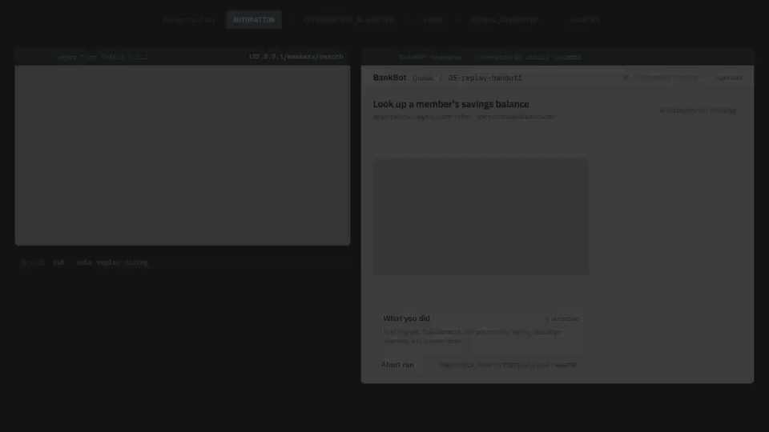
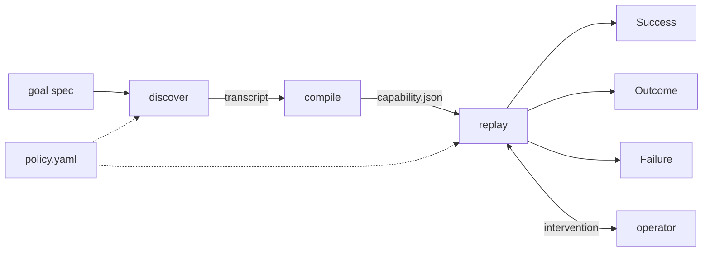

# bankbot

[](https://github.com/JoshTSeppich/bankbot/actions/workflows/ci.yml)

An LLM drives a legacy-style bank UI once; every run after that is a typed artifact replayed with no model in the loop.

The recording names each control the way a person sees it, so it can be reviewed, versioned and rerun. When replay cannot safely continue it hands the live browser to a person — and still checks their work. This is my take-home submission for interface.ai; the design write-up is [REPORT.md](REPORT.md).

<p align="center">
  <a href="docs/media/handoff.mp4"></a>
</p>

**The operator marks the step complete. The engine checks anyway, and refuses.** Reconstructed from [`evidence/05-replay-handoff`](evidence/05-replay-handoff) — an animation, not a screen recording. Full resolution: [MP4](docs/media/handoff.mp4).

<details>
<summary>The same sequence in text</summary>

1. Replay logs in (a declared recovery, not a failure), opens the search screen and types the member id.
2. It clicks Search. A modal the capability never recorded covers the page, so the click times out. Two declared retries time out the same way.
3. Replay raises an intervention, reason `unknown_dialog`, and waits. The operator page shows the step, what was expected and what was observed.
4. The operator takes control of the same browser window and answers **Mark step complete**.
5. Replay checks that step's `wait_for` — `The page moved to /members/results$` — which does not hold. It raises a second intervention, reason `checkpoint_unmet`.
6. The operator takes control again and aborts. The run ends `"kind": "failure"`.

Every line above is in [`evidence/05-replay-handoff/log.jsonl`](evidence/05-replay-handoff/log.jsonl).

</details>

[Quick start](#quick-start) · [Discovery and replay](#discovery-and-replay) · [What each run proves](#what-each-evidence-run-proves) · [What is mocked](#what-is-mocked-and-why) · [Architecture](#architecture) · [Checks](#development-and-validation) · [Further reading](#further-reading)

## Quick start

```
uv sync
uv run playwright install chromium
uv run pre-commit install
uv run pytest
```

The tests start the demo bank app and a headless Chromium themselves. Nothing else needs to be running, and no API key is needed for anything except discovery.

Replay the committed capability on a fresh clone, still with no key:

```
make replay
```

To run discovery, copy `.env.example` to `.env` and set `ANTHROPIC_API_KEY`. Every other variable has a working default.

## Discovery and replay

The system has two paths and only one of them talks to a model.

| Stage | Model? | What it does | Output |
|---|---|---|---|
| **Discovery** | Yes, once | Observes the page, asks the model for one action, checks it against policy, acts | A typed transcript |
| **Compilation** | No | Turns that transcript plus a goal spec into a capability, deterministically | `capability.json` |
| **Replay** | No | Executes the capability against the live app and classifies what happens | `Success`, `Outcome` or `Failure` |

Replay ends in one of three shapes, and the difference between them is the point:

- **Success** — the checkpoint held; typed outputs are returned to the caller.
- **Outcome** — a *business outcome* the capability declared, such as `member_not_found`. The caller asked a question and got an answer; it is not an error.
- **Failure** — an *execution failure*. The step, what was expected and what was observed are all in the result.

Two things happen between a step failing and a run failing:

- **Recovery** — a detour the artifact declared, such as logging back in after a session expires. Recoveries are named in `recoveries_used` on every run, so logging in is never mistaken for a failure.
- **Human intervention** — replay hands over the live browser when its rules run out. The operator can hand back, mark the step complete, or abort.

**Checkpoint validation is what makes the handoff trustworthy.** Marking a step complete is a claim, not a result: replay re-checks the step's `wait_for` before accepting it, and a claim that does not hold raises a fresh intervention instead of a success. The demo above is that path.

```
make replay                 # "kind": "success", outputs {"savings_balance": "4242.00"}
make replay-notfound        # "kind": "outcome", "code": "member_not_found" — an answer, not a crash
make replay-expiry          # recoveries_used [session_expired, session_expired], then success
make replay-variant-b       # warnings variant_mismatch and drift_warning, then success
make replay-dialog          # headed; stops on an unknown modal and prints an operator URL
make discover               # needs ANTHROPIC_API_KEY; the model drives the app once
```

Each prints its result as JSON and then `event sequence: sha256:…`. `make demo` runs discovery and the first three replays; `make operator` browses finished runs.

For the handoff, `make replay-dialog` prints an operator URL. Open it, press Take control, dismiss the modal in the browser window that is already open, then press Hand back — the run resumes from the step it stopped on and finishes.

## What each evidence run proves

Every row is a committed directory holding its log, screenshots and trace. `make verify-evidence` re-reads them and recomputes the hashes.

| Scenario | Command | Evidence | What it proves |
|---|---|---|---|
| Discovery, a real model call | `make evidence-01` | [`01-discovery`](evidence/01-discovery) | The model drives a live UI to the goal and the run compiles to `capability.json`, with the seven API request ids in it |
| Replay, five times | `make evidence-02` | [`02-replay-success`](evidence/02-replay-success) and `-2` to `-5` | Determinism: one event-sequence hash and one answer across five fresh browsers |
| A member who does not exist | `make evidence-03` | [`03-replay-member-not-found`](evidence/03-replay-member-not-found) | A business outcome is a result, not a failure |
| Session expiry mid-run | `make evidence-04` | [`04-replay-session-expiry-recovered`](evidence/04-replay-session-expiry-recovered) | A declared recovery runs, the rewind logs back in, the run still succeeds |
| An unknown modal, with an operator | `make evidence-05` | [`05-replay-handoff`](evidence/05-replay-handoff) | A person takes the live session and claims the step; checkpoint validation rejects the claim and the run ends as a `Failure` |
| A risky goal | `make evidence-06` | [`06-discovery-risky-blocked`](evidence/06-discovery-risky-blocked) | Policy blocks an irreversible action the model proposed, and nothing compiles |
| A second tenant's build | `make evidence-07` | [`07-replay-variant-b`](evidence/07-replay-variant-b) | One artifact on a different build: two drift warnings, still success |

`evidence-01` and `evidence-06` are the only commands here that call a model. Rebuilding the artifact without one is `uv run python -m bankbot.cli compile evidence/01-discovery`. A run directory is never overwritten, so redoing one means deleting it first; the [Makefile](Makefile) has the exact commands and the order.

## What is mocked and why

The bank app is my own FastAPI app, [`bankbot/target/`](bankbot/target), not a vendor product. I wrote it so I could trigger every condition the brief names on demand — table layouts, an iframe, no ids, a session that expires, a dialog nobody has seen — without a real bank, real member data or a terms-of-service problem. It has a second variant under `/b` standing in for another tenant's build.

The operator page is two Jinja pages in the same process as the run. There is one operator and no login. The mechanism under it is real: same browser, same session, actions recorded, and a lease that ends the run if the operator's page goes away.

The animation at the top is a reconstruction. Everything it shows is in `evidence/05-replay-handoff`; the pixels are not a screen capture.

Nothing else is mocked. The discovery run in `evidence/01-discovery` is a real model call, with the request ids in the artifact.

## Architecture



One package, one process, no queue, no database. The model appears in `discover/` and nowhere else; `compile/` and `replay/` never import the SDK, which [a test pins](tests/discover/test_sdk_import.py).

A capability is a function: typed `inputs`, typed `outputs` naming the control they are read from, `preconditions`, ordered `steps`, a `checkpoint`, declared `outcomes` and `recoveries`, and per-step `on_fail`. Each control is a ranked list of candidates carrying a strategy, a confidence and the reasoning behind it, so a locator that ages shows up as a `drift_warning` rather than a silent wrong answer. The contract is [`bankbot/schemas/artifact.py`](bankbot/schemas/artifact.py), exported to [`docs/schema/capability.schema.json`](docs/schema/capability.schema.json).

[REPORT.md](REPORT.md) has the architecture at length; the six [ADRs](docs/adr) have the decisions and what I rejected.

## Development and validation

```
make review
```

That is the whole gate in one command: `ruff format`, `ruff check`, `mypy --strict`, the test suite, the evidence check, and one replay against the committed capability. It needs no API key, it is what runs before every commit, and [CI](.github/workflows/ci.yml) runs the same steps on every push.

Individual pieces:

```
make lint                   # format check, lint, mypy --strict
make test                   # pytest
make verify-evidence        # re-read every directory under evidence/ and recompute hashes
```

## Further reading

- [REPORT.md](REPORT.md) — the write-up, under the seven headings from the brief.
- [docs/adr/](docs/adr) — the six decisions the design rests on, with the alternatives I rejected.
- [docs/schema/capability.schema.json](docs/schema/capability.schema.json) — the artifact contract as JSON Schema.
- [evidence/](evidence) — the seven runs in the table above, in eleven directories because run 2 is replayed five times.
- [policy.yaml](policy.yaml) — the allowlist, the risky patterns and the redaction rules, in one file.
- [github.com/JoshTSeppich/cairn](https://github.com/JoshTSeppich/cairn) — the working discipline this was built under, as a Claude Code plugin.
- [github.com/JoshTSeppich/Lantern](https://github.com/JoshTSeppich/Lantern) — the screen-shape method [`bankbot/surface/fingerprint.py`](bankbot/surface/fingerprint.py) ports.
